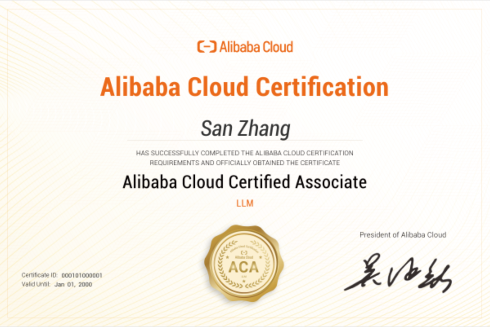

<h2 align="center">阿里云大模型工程师 ACA 认证学习笔记</h2>

<h3 align="center">完整的大模型知识体系 · 思维导图 + 详细笔记</h3>

  
  
  
   
 [<a href="/README.md">中文(简体)</a>] | [<a href="/README_EN.md">English</a>] 

> If you find it useful, welcome to star⭐, and you are also welcome to submit an issue for further discussion or PR proofreading.

这是我整理的阿里云大模型工程师 ACA 认证课程学习笔记，包含思维导图版与逐章笔记版两套内容，便于复习、回顾和检索。

如果觉得有帮助，欢迎 star⭐，也欢迎提 issue 交流学习想法。

## 课程内容

### 课程大纲

| 章节 | 主题 | 核心内容 |
|-----|------|--------|
| **第01章** | 认识大模型 | 大模型基础概念、发展历史、关键特性 |
| **第02章** | 大模型应用场景 | 智能客服、内容生成、代码助手、数据分析等 |
| **第03章** | API 的使用 | 模型 API 调用、参数优化、错误处理 |
| **第04章** | 提示词工程 | 提示词设计原则、优化技巧、最佳实践 |
| **第05章** | 工具调用 | 插件机制、函数调用、工具集成 |
| **第06章** | RAG 知识库 | 文档检索、向量化、增强生成 |
| **第07章** | 大模型微调 | 微调方法、训练策略、垂直领域优化 |
| **第08章** | Agent 应用 | Agent 架构、任务规划、决策执行 |
| **第09章** | 应用安全 | 隐私保护、安全合规、风险防控 |
| **第10章** | 拓展学习 | 多模态模型、MoE 架构、云端协同 |

### 思维导图

点击下方章节标签快速跳转：

  
第01章 - 认识大模型

- [大模型基础](./00-思维导图/【01-认识大模型】——%20大模型基础.md)

  
第02章 - 大模型应用场景

- [大模型的典型应用场景](./00-思维导图/【02-大模型应用场景】——%20大模型的典型应用场景.md)

  
第03章 - API 的使用

- [借助API让大模型自动化处理任务](./00-思维导图/【03-API的使用】——%20借助API让大模型自动化的处理任务.md)

  
第04章 - 提示词工程

- [使用提示词优化回答质量](./00-思维导图/【04-提示词工程】——%20使用提示词优化回答质量.md)

  
第05章 - 工具调用

- [使用插件工具增强大模型的能力](./00-思维导图/【05-工具调用】——%20使用插件工具增强大模型的能力.md)

  
第06章 - RAG 知识库

- [通过RAG知识库检索增强生成](./00-思维导图/【06-RAG知识库】——%20通过RAG知识库检索增强生成.md)

  
第07章 - 大模型微调

- [通过微调改善大模型在垂直领域的表现](./00-思维导图/【07-大模型微调】——%20通过微调改善大模型在垂直领域的表现.md)

  
第08章 - Agent

- [借助Agent让大模型应用思考、决策并执行任务](./00-思维导图/【08-Agent】——%20借助Agent让大模型应用思考、决策并执行任务.md)

  
第09章 - 应用安全

- [大模型应用的安全合规](./00-思维导图/【09-应用安全】——%20大模型应用的安全合规.md)

  
第10章 - 拓展学习

- [多模态大模型、MoE混合专家模型、大小模型云端协同](./00-思维导图/【10-多模态大模型】——%20多模态大模型、MoE混合专家模型、大小模型云端协同.md)

### 课程内容笔记

点击下方章节标签查看完整笔记：

  
第01章 - 认识大模型

- [认识大模型](./01-笔记/01-认识大模型.md)

  
第02章 - 大模型应用场景

- [大模型的典型应用场景](./01-笔记/02-大模型的典型应用场景.md)

  
第03章 - API 的使用

- [借助API让大模型自动化地处理任务](./01-笔记/03-借助API让大模型自动化地处理任务.md)

  
第04章 - 提示词工程

- [通过优化提示词来提升回答质量](./01-笔记/04-通过优化提示词来提升回答质量.md)

  
第05章 - 工具调用

- [通过插件增强大模型的能力](./01-笔记/05-通过插件增强大模型的能力.md)

  
第06章 - RAG 知识库

- [通过RAG增强大模型原本无法回答的问题](./01-笔记/06-通过RAG增强大模型原本无法回答的问题.md)

  
第07章 - 大模型微调

- [通过微调改善大模型在垂直领域的表现](./01-笔记/07-通过微调改善大模型在垂直领域的表现.md)

  
第08章 - Agent

- [借助Agent让大模型应用思考、决策并执行任务](./01-笔记/08-借助Agent让大模型应用思考、决策并执行任务.md)

  
第09章 - 应用安全

- [大模型应用的安全合规](./01-笔记/09-大模型应用的安全合规.md)

  
第10章 - 拓展学习

- [多模态大模型、MoE专家架构、大小模型云端协同](./01-笔记/10-拓展学习：多模态大模型、MoE专家架构、大小模型云端协同.md)

## ⭐ Star History

## 📚 参考资源

- **官方课程** - [阿里云大模型工程师 ACA 认证课程](https://edu.aliyun.com/certification/aca13?spm=5176.38069147.J_HzKgVczpY3grCE0p2ViJx.10.3d0b33efC9r2H7)
- **文档资料** - 课程实验、案例示例和最佳实践
- **学习笔记** - 个人整理、复习总结和知识延伸

## License

Licensed under the MIT License. See [LICENSE](LICENSE) file for details.

---

  Made with ❤️ for ACA Learners · 2026

